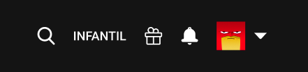
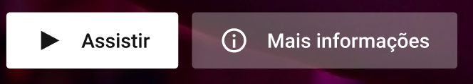
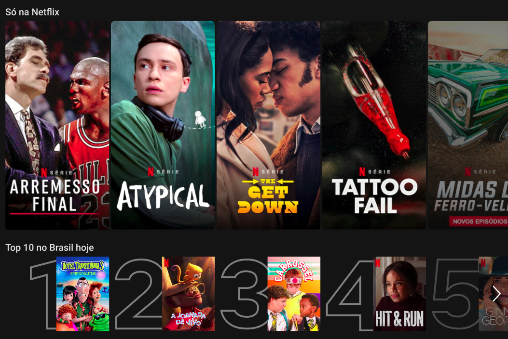
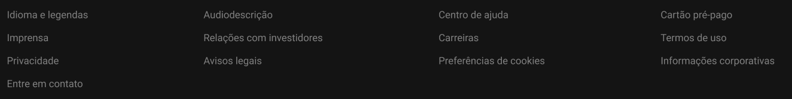

# Kenzieflix

Projeto desenvolvido na parte 2 da maratona de programação da Kenzie Academy Brasil. Projeto desenvolvido na parte 2 da maratona de programação da Kenzie Academy Brasil para estudar, testar e estruturar conceitos nas linguagens HTML e CSS para o front-end. Neste projeto foram abordados:

- HTML para desenvolvimento web 
  - Tags de Navegação, semântica, peso semântico e conceitos;
  - Cabeçalhos e rodapés;
  - Vídeo, áudio e saída;
  - Artigos;
  - Figuras e legendas e;
  - Detalhes.

- CSS para desenvolvimento web
 - O que é CSS, estilização e padronização BEM;
 - Suporte para browser e suas versões;
 - Seletores e atributos de pseudo classe;
 - Seletores de atributo de correspondência de substring;
 - Noções básicas e terminologia;
 - Prefixando Flexbox e;
 - Propriedades relacionadas;

## Ferramentas

A ferramenta principal utilizada foi [VSCode](https://code.visualstudio.com/)

## O Projeto

Kenziefliz é uma plataforma fictícia de filmes criado 100% nas linguagens HTML5 e CSS3 para práticas e implementação de conceitos importantes na construção de um projeto front-end. 

### Estrutura de arquivos

- kenzieflix
    - README.md
    - index.html
    - /assets
        - /css
            - style.css
        - /img

### Fonte

- 'Roboto', sans-serif;

### Cores

- Preto: #141414
- Bege: #E5E5E5
- Branco: #FFFFFF
- Cinza escuro: #6D6D6E
- Vermelho: #B9090B
- Cinza claro: #808080

## O Desafio Kenzieflix

### 1. Ícones cabeçalho

Foram adicionados os ícones ao cabeçalho. As imagens já foram baixadas e estão nesse projeto. As imagens estão no `/assets/img`. A imagem em destaque foi adicionada ao cabeçalho, conforme o layout do figma como no exemplo abaixo:



### 2. Botões "Assistir" e "Mais informações"

O desafio foi dividido em duas partes.

#### 2.1 Modificador no botão "Mais informações"

O botão "Mais informações" possui um estilo diferente do botão "Assistir". Então foi adicionado um modificador para diferenciar a estrutura desses botões e torná-los mais usáveis.

_*Note que a cor de fundo do botão "Mais Informações" possui uma transparência, não é uma cor sólida(opaca)_

#### 2.2 Ícones nos botões

Esses dois botões possuem um ícone. Nessa parte do desafio foram adicionados os devidos ícones aos botões. Encontram-se em `/assets/img`. Finalizando a segunda parte do desafio, ficou assim:



### 3. Adicionadas as seções "Só na Netflix" e "Top 10 no Brasil hoje"

Na aula foi mostrado o desenvolvimento de duas seções de lista de filmes. Então conforme estudos, foram adicionadas as seções "Só na Netflix" e "Top 10 no Brasil hoje". As imagens foram encontradas em `/assets/img`. Abaixo um exemplo de como ficou, conforme o layout desenhado no figma:



### 4. Finalizado com rodapé

Foram adicionados os elementos faltantes no rodapé, conforme imagem abaixo:



### 5. Estilização da scrollbar da "seções de filmes"

Para aplicar o efeito carrossel às seções de filmes, foi adicionado uma scrollbar em cada uma das seções. Afim de melhorar o layout, adicionei um estilo que combine com a cara dele, melhorando esteticamente o uso de scrollbar. Adicionei o seguinte código ao CSS:

```css
*{
    scrollbar-width: thin;
    scrollbar-color: #fff #141414;
    
}
*::-webkit-scrollbar {
    width: 9px;
}

*::-webkit-scrollbar-track {
    background: #141414;
}

*::-webkit-scrollbar-thumb {
    background-color: #fff;
    border-radius: 20px;
    border: 2px solid #141414;
}
```

## Layout

### Figma

Coming soon

### Imagem

- [Imagem Desktop](./assets/img/desktop.png)
- [Imagem Mobile](./assets/img/mobile.png)

### Resultado final